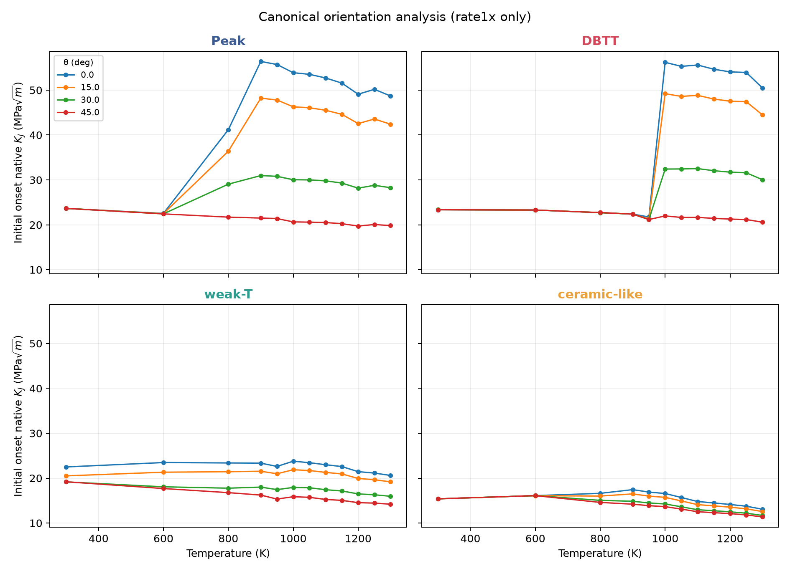
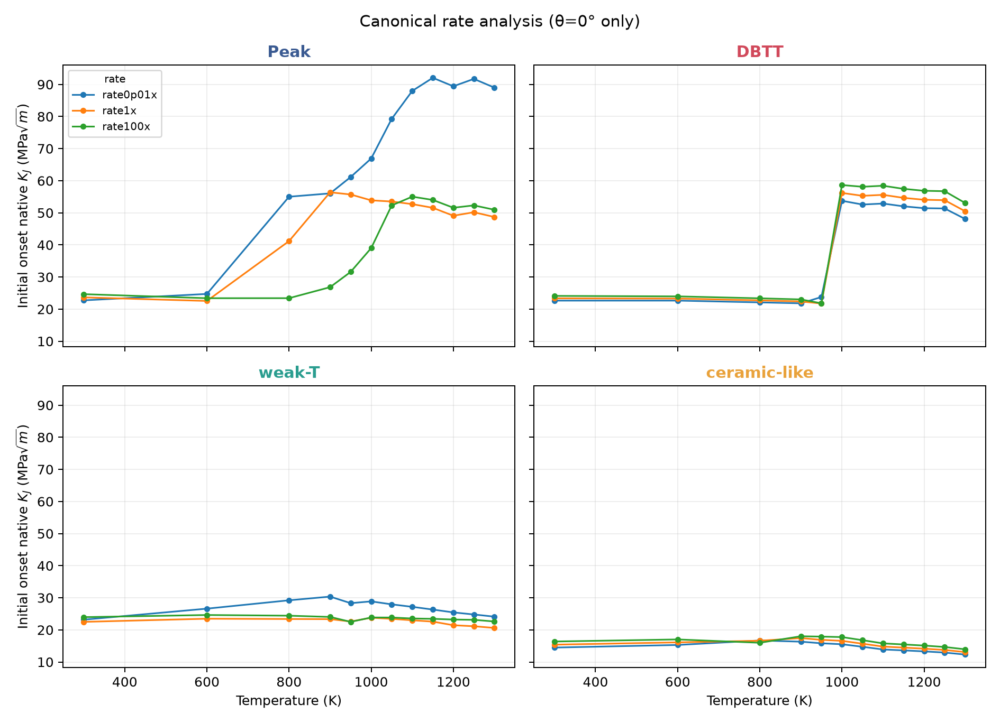
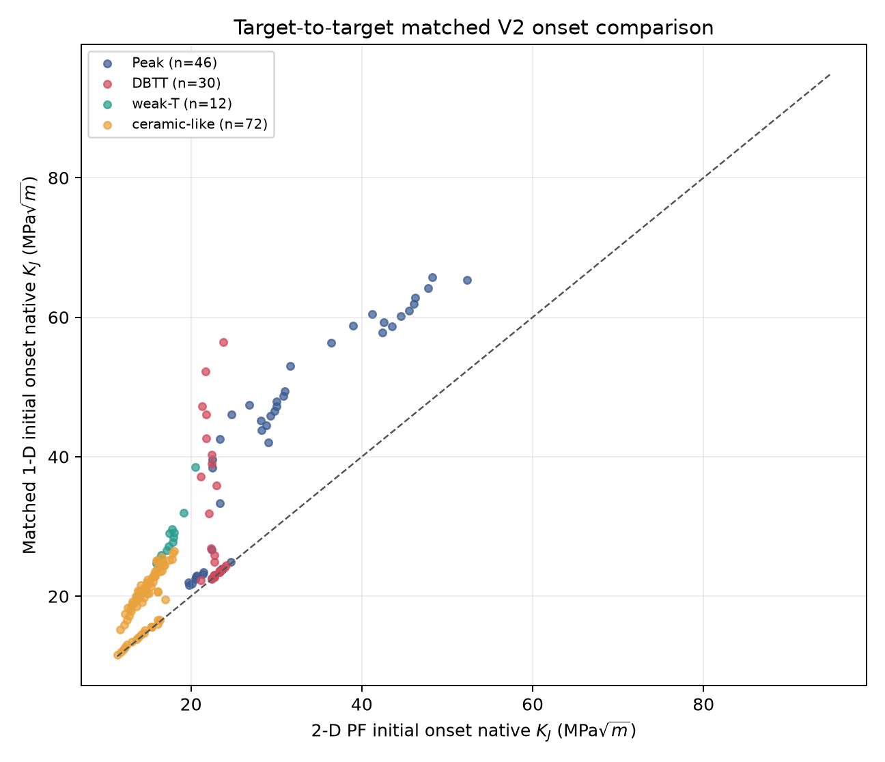

# Canonical PF fracture campaign V2 final report

## Decision

The locked 288-condition campaign is complete: all 288 PF cases reached 1000 µm, all event/observer ledgers close, and the 96 previously completed θ=15°/30° cases remain byte-immutable. The 192 newly executed cases comprise 48 θ=45°/rate1x cases and 144 θ=0° rate cases. No completed θ=15°/30° case was rerun. The 42 θ=45°/rate0.01x cases remain supplemental and are excluded from the primary rate analysis.

The orientation and loading-rate analyses are separate by construction. The θ analysis contains 192 cases at rate1x (including the 48 θ=0°/rate1x cases); the rate analysis contains 144 cases at θ=0° (including the same 48 shared cases). Thus no off-axis extreme-rate result contaminates either primary comparison.

Native event histories are **PF MODEL-NATIVE DRIVING TRAJECTORIES**. Reload-separated pre-event values are **effective resistance candidates**. Individual in-avalanche eventwise native $K_J$ values are not interpreted as an R-curve.

## Orientation analysis

| Class | theta_deg | n | Mean onset | Mean ΔK reinit* | Mean largest-avalanche fraction |
|---|---:|---:|---:|---:|---:|
| Peak | 0.0 | 12 | 46.591 | NA | 1.000 |
| Peak | 15.0 | 12 | 40.795 | -0.041 | 0.997 |
| Peak | 30.0 | 12 | 28.441 | 1.342 | 0.994 |
| Peak | 45.0 | 12 | 21.026 | 6.131 | 0.955 |
| DBTT | 0.0 | 12 | 41.141 | -1.862 | 0.948 |
| DBTT | 15.0 | 12 | 37.263 | 5.745 | 0.848 |
| DBTT | 30.0 | 12 | 27.977 | 7.370 | 0.901 |
| DBTT | 45.0 | 12 | 21.889 | 8.557 | 0.929 |
| weak-T | 0.0 | 12 | 22.604 | -2.929 | 0.978 |
| weak-T | 15.0 | 12 | 20.858 | -1.614 | 0.908 |
| weak-T | 30.0 | 12 | 17.462 | 1.414 | 0.946 |
| weak-T | 45.0 | 12 | 15.855 | 1.946 | 0.978 |
| ceramic-like | 0.0 | 12 | 15.412 | -0.583 | 0.947 |
| ceramic-like | 15.0 | 12 | 14.816 | -0.797 | 0.920 |
| ceramic-like | 30.0 | 12 | 13.818 | 0.197 | 0.972 |
| ceramic-like | 45.0 | 12 | 13.418 | 0.284 | 0.932 |

The table reports descriptive means over the 12 pinned temperatures for each class/orientation. It shows strong orientation dependence for Peak and DBTT onset and weaker, still systematic changes for weak-T and ceramic-like. These are model-native PF responses under the locked horizontal crack-path/rotated-cubic-elasticity semantics; they are not continuum-$G$ claims.

## Rate analysis

| Class | rate_tag | n | Mean onset | Mean ΔK reinit* | Mean largest-avalanche fraction |
|---|---:|---:|---:|---:|---:|
| Peak | rate0p01x | 12 | 68.000 | NA | 1.000 |
| Peak | rate1x | 12 | 46.591 | NA | 1.000 |
| Peak | rate100x | 12 | 40.423 | -3.636 | 0.996 |
| DBTT | rate0p01x | 12 | 39.586 | -2.323 | 0.948 |
| DBTT | rate1x | 12 | 41.141 | -1.862 | 0.948 |
| DBTT | rate100x | 12 | 42.964 | -1.912 | 0.948 |
| weak-T | rate0p01x | 12 | 26.863 | NA | 1.000 |
| weak-T | rate1x | 12 | 22.604 | -2.929 | 0.978 |
| weak-T | rate100x | 12 | 23.598 | -3.101 | 0.978 |
| ceramic-like | rate0p01x | 12 | 14.578 | -0.522 | 0.947 |
| ceramic-like | rate1x | 12 | 15.412 | -0.583 | 0.947 |
| ceramic-like | rate100x | 12 | 16.232 | -0.659 | 0.947 |

The rate comparison uses θ=0° only and common random numbers across the three rates for each class/temperature. Peak shows the largest aggregate rate separation; DBTT and ceramic-like shift more modestly. A missing ΔK reinit value means that a case had no reload-separated reinitiation onset before the right-censored target, not zero resistance change.

## Matched V2 one-dimensional comparison

All 288 plan IDs were evaluated with angle-matched, candidate-independent discrete mechanics maps and without extrapolation. Of these, 160 are target-to-target comparisons and 128 terminate at the qualified 1-D drive-map bound. For the target-to-target subset, the 1-D minus PF initial-onset bias is 7.722 MPa√m and the mean absolute difference is 7.723 MPa√m. Bound-limited rows remain explicit and are not promoted to target-reaching agreement.

## Branching capability demonstration

The retained positive result is labelled `CAPABILITY_DEMONSTRATION_NOT_VALIDATED_BRANCHING_PHYSICS`. It is the completed historical V11 weak-T/700 K/θ=30° 300 µm segment, which recorded a committed branch birth at step 295. It is retained only as repository-lineage capability evidence: its V11 topology backend is not source-compatible with the frozen canonical single-crack source. Five bounded frozen-source branch-enabled probes reached their targets without a daughter birth and are recorded as negative compatibility diagnostics. None of these results validates branching nucleation, competition, topology, or fracture-resistance physics.

## Historical disposition and storage

- No historical production trajectory is promoted into a newly executed V2 condition. The 96 reusable θ=15°/30° cases are the already verified current campaign copies pinned by result and observer hashes.
- Historical weak-T/ceramic rows and the historical θ=45° extreme-rate source remain stale/historical-only.
- The verified legacy archive is retained. The earlier exact duplicate deletion reclaimed 7.255 GiB; this publication performed no new destructive cleanup and did not regenerate the historical inventory.
- Final-field-only output and consolidated event observers are retained for the new cases. Full image sequences can be reconstructed later for selected examples.

## Provenance and closure

- Campaign lock fingerprint: `5928e6abb7dcd59e6387d5d479128fec83c3ba4d509bae3a0e757b9e9ece5dde`
- Scientific-plan fingerprint: `f3928476f2564a3eb10ca4737780a38578d9517a860bd77a9321dcd94fd4df99`
- Plan CSV SHA-256: `fa3c44d7d2932f0010584a89efe83496624eb4c3f00ed1622b42167b05263b72`
- Final publisher source commit: `b06e7cbcfc535081c8836f988e601eeea620892b`
- Canonical case count: 288/288; target reached: 288/288
- Event-boundary state-profile rows: 60504
- Event/observer closure: `true`
- Historical inventory regenerated: false
- Full suite: 585 passed; 7 unchanged legacy failures; no new failures
- Focused canonical tests: 53 passed
- Compileall / git diff check / deterministic regeneration: pass / pass / pass

The final decision JSON and artifact-hash manifest are the machine-readable authority for this report.

* ΔK reinit is computed only where a finite reload-separated reinitiation onset exists.
