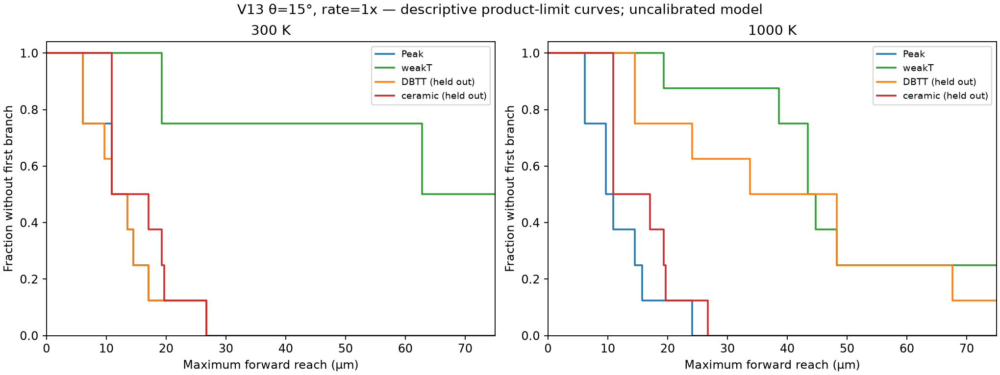
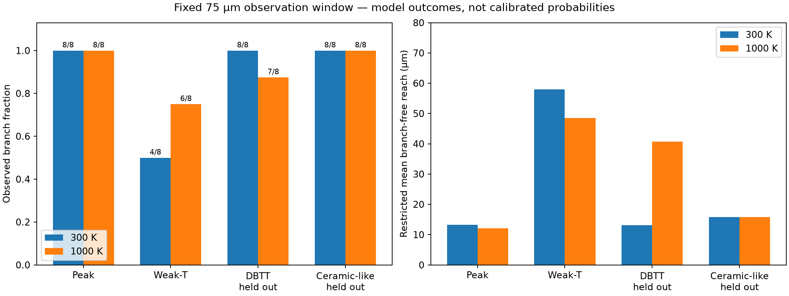
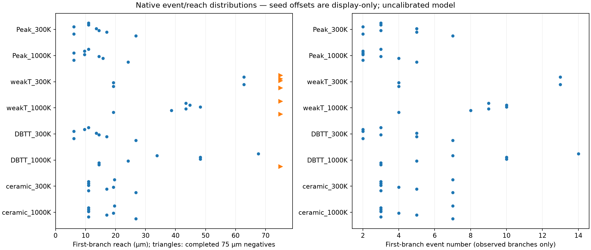
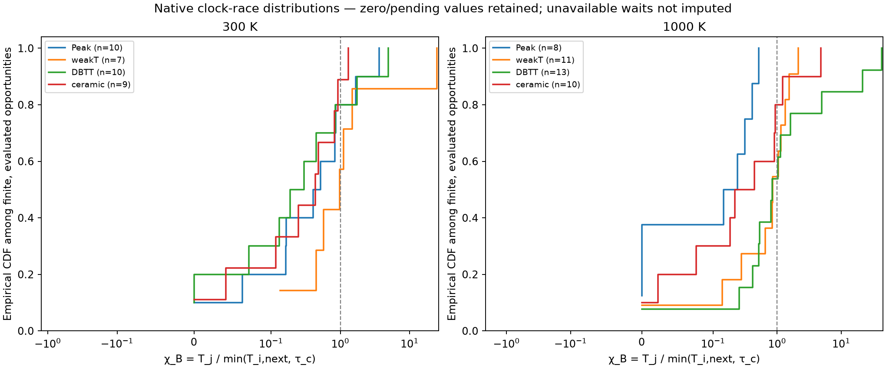
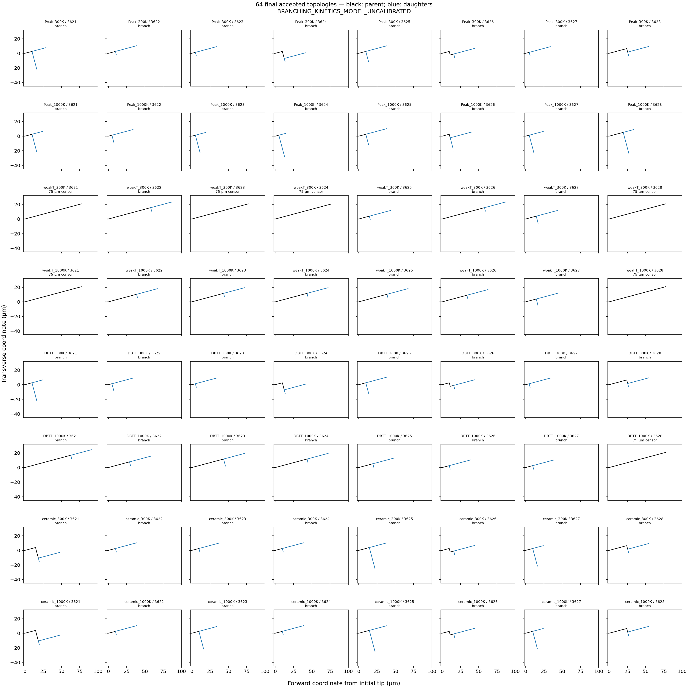

# Final V13 four-material first-branch comparison

**BRANCHING_KINETICS_MODEL_UNCALIBRATED**

All 32 held-out cases terminated under the frozen rules: 31 observed branches, 1 completed nonbranching observations, and 0 early-gate censors. The 32 accepted Peak/weak-T trajectories were reused without modification. The simulation program is stopped; no further screening, tuning or trajectories are authorized by this block.

## Eight-group descriptive results

| Group | Branches / 8 | Completed 75 µm negatives | Early gates | Median first-branch reach (µm) | Restricted mean to 75 µm (µm) | First-branch event range |
|---|---:|---:|---:|---:|---:|---|
| Peak_300K | 8 | 0 | 0 | 10.95 | 13.25 | [2, 7] |
| Peak_1000K | 8 | 0 | 0 | 9.66 | 12.12 | [2, 5] |
| weakT_300K | 4 | 4 | 0 | 62.79 | 58.03 | [4, 13] |
| weakT_1000K | 6 | 2 | 0 | 43.47 | 48.49 | [4, 10] |
| DBTT_300K | 8 | 0 | 0 | 10.95 | 13.09 | [2, 7] |
| DBTT_1000K | 7 | 1 | 0 | 33.81 | 40.77 | [3, 14] |
| ceramic_300K | 8 | 0 | 0 | 10.95 | 15.83 | [3, 7] |
| ceramic_1000K | 8 | 0 | 0 | 10.95 | 15.83 | [3, 7] |

DBTT and ceramic-like were held out from selection of this condition. Their results were not used to change orientation, loading rate, seeds, parameters or the V13 rule. They are not experimentally validated held-out data. Peak/weak-T seed 3621 remains the condition-selection seed; the other seven seeds are additional paired realizations, not a correction for all selection bias.

Peak (both temperatures), DBTT/300 K and ceramic-like (both temperatures) show high incidence: 8/8 each. Weak-T has the clearest mixed-incidence transition (4/8 at 300 K, 6/8 at 1000 K). DBTT/1000 K is delayed and slightly reduced (7/8; restricted mean branch-free reach 40.77 µm versus 13.09 µm at 300 K). Temperature effects are parameterization-specific: the descriptive direction differs between weak-T and DBTT; ceramic-like has equal incidence and equal restricted means at these two temperatures. These small-sample counts are model outcomes, not calibrated physical probabilities.

Larger restricted mean branch-free reach denotes later or absent branching within 75 µm. The median is the first reach where the product-limit curve is at or below 0.5, not the median conditional on an observed branch. No confidence interval or statistical material-probability calibration is assigned. Early model/numerical censors can be informative and are never counted as completed nonbranching observations. A restricted mean to 75 µm is left unavailable if observation support ends earlier with positive branch-free survival.

The censor is the prespecified 75 µm maximum-forward-reach threshold. Native 5 µm events are not shortened; the last accepted unbranched endpoint can exceed that threshold. Branches already accepted within the window continue through the existing 20 µm daughter-growth stop, or a legitimate gate. First-branch primary reach, junction coordinate, event number, time and opening are retained separately in the case table.

## Saturation, pending companions and energy margins

| Group | Births | Primary near asymptote | Companion near asymptote | Completed pending companion |
|---|---:|---:|---:|---:|
| Peak_300K | 8 | 8 | 7 | 1 |
| Peak_1000K | 8 | 8 | 6 | 3 |
| weakT_300K | 4 | 4 | 3 | 0 |
| weakT_1000K | 6 | 6 | 3 | 1 |
| DBTT_300K | 8 | 8 | 6 | 2 |
| DBTT_1000K | 7 | 7 | 7 | 1 |
| ceramic_300K | 8 | 8 | 8 | 1 |
| ceramic_1000K | 8 | 8 | 8 | 1 |

Near saturation means effective λτc ≥ 0.99, a descriptive convention retained from the accepted audit, not a modified physical threshold. Raw and effective λτc, completed-pending status and the exact native pair-energy margin in J/m are exported for every birth. All native opportunities are also retained. Early-exit fields that were not evaluated remain unavailable; no rates, tensors, release energies or margins were fabricated or recomputed to fill gaps.

The χ_B distributions use T_j / min(T_i,next, τ_c) directly from the archived native waits, separately for all opportunities and accepted births. Inherited-pending companions retain χ_B=0 when the primary race window is positive. Infinite and unevaluated waits have separate status counts and are not silently assigned finite values. The plotted empirical distributions condition on finite evaluated values; all statuses and exact pair-energy margins are exported in chi_B_and_pair_margin_distributions.json.

The accepted 15° screening energy margins were far from veto; this remains evidence for a kinetic transition in the selection groups. Absolute held-out pair margins are reported directly and are not silently converted to normalized energy margins without archived release/cost data. A pending completion survives later rate changes: its current small rate does not erase its already-completed event.

## Interpretation boundaries

The accepted mixed first-branch incidence and model-internal material sensitivity remain established for the tested window. The tables extend the same frozen rule to the two unused parameterizations; they do not establish experimental probability laws. Common seeds are paired across groups at fixed orientation; no independent-exchangeable interpretation of all 64 cases is used. Full paired-seed outcome tables are provided, including early-censor unknowns.

Temperature contrasts are descriptive, not statistically established. Candidate angles remain crystallographic, the morphology mark remains zero-global-time, and these runs do not test recursive branch spacing or calibrated microbranch survival/arrest. Continuous emission, cleavage hazards, tau_c, material rows, pair-energy rules and marked-event bookkeeping were not changed.

## Verification and merge disposition

Full repository suite: return code 1; 1135 recorded test cases; 31 failures/errors; 5 skipped. Merge gate: **NOT_CLEARED_FULL_SUITE_FAILURES**. The full suite was run once after all new trajectories terminated. Full failure details, if any, are retained; no source-physics fixes or simulation reruns were made in response.

The assessment’s four restricted means and medians reproduce to the quoted two decimals. Its 26/26 primary-saturated births and five pending-companion births also reproduce. The accepted transition and theta40 file seals are verified before and after analysis. Raw process fingerprint differences between the earlier screen and production remain documented as run-local mechanics-call serial differences; no within-run freshness check was removed.

Accepted transition record: `b2e0e2d85e048553ad2593d895a98974356213e2`. Frozen physics source: `35f4a03c622112cd5bc7cf9bc08c5b7fe2387e46`. New launch commits: `7c6ef4080b6fed2e21c3f8d4cf6308186853190d, fdf43801603cbca0eea60b574afa7f9da4d4f180`. Report-producer commit: `98f9b5d579e9d593c088bcfc1da9f7ccc8529093`. These provenance roles are separate.

Raw held-out results and final portable fields are in `../ensemble/<case>/`. The compact archive contains reports, tables, figures and test records; native checkpoint/file hashes remain available in provenance.json. No automatic merge is performed by the reporting script.

