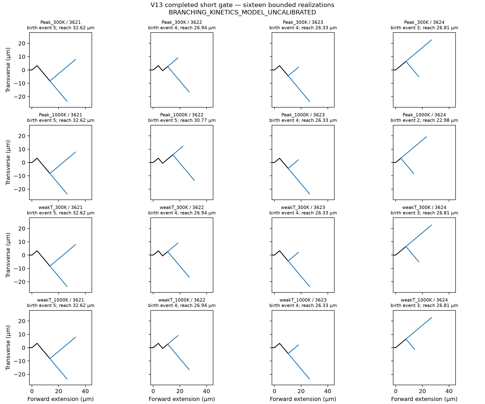

# V13 tip-local correction and completed short ensemble

**BRANCHING_KINETICS_MODEL_UNCALIBRATED**

Formal classification: **STOCHASTIC_BUT_SATURATION_DOMINATED**. All sixteen cases formed a first branch and reached a scientific terminal condition. These are bounded capability calculations, not calibrated branch probabilities.

## Narrow defect and correction

The sealed step-419 replay reproduced a two-arm action consuming `(010)#2` and `(100)#3` from different pre-event daughter tips. Their completion times were 3424.8555772088716 and 3424.8555771377714 s, respectively (about 71.1 ns apart). They share process owner `jbe1d699748fbb56`, but not an event owner. This is outcome A: cross-tip events incorrectly grouped as one action. There was no coalescence or new branch in that failed proposal.

Proposal grouping now uses the pre-event tip and its branch-birth opportunity. Multifront proposal identity contains `(front_id, candidate_id, ordinal)`. Legacy clock/event keys remain unchanged to preserve checkpoint thresholds and RNG. Same-tip correlation rules are unchanged; tip-local winners compete globally by completion time. The original owner guard is byte-identical. No rates, material fields, correlation time, pair-energy rule, or marked-parent semantics changed.

The live continuation resumed exactly once from step 419, SHA-256 `3209c19513c44557a222aed5b8b026f71202fd8ab7655f24fc573229ac8c27cf`. Step 420 consumed only the earlier `(100)#3`; the preserved `(010)#2` was consumed later at step 421. The original failed output remains evidence, not the authoritative terminal result. The thirteen completed cases were not rerun; 2932 original input artifacts retain their hashes.

## Completed case table

| Case | Birth event | Junction forward (µm) | Primary reach at birth (µm) | Final reach (µm) | Terminal reason |
|---|---:|---:|---:|---:|---|
| Peak_300K_seed3621 | 5 | 13.47204 | 16.68597 | 32.62315 | qualified_daughter_early_stop |
| Peak_1000K_seed3621 | 5 | 13.47204 | 16.68597 | 32.62315 | qualified_daughter_early_stop |
| weakT_300K_seed3621 | 5 | 13.47204 | 16.68597 | 32.62315 | qualified_daughter_early_stop |
| weakT_1000K_seed3621 | 5 | 13.47204 | 16.68597 | 32.62315 | qualified_daughter_early_stop |
| Peak_300K_seed3622 | 4 | 10.87438 | 14.70460 | 26.94407 | qualified_daughter_early_stop |
| Peak_1000K_seed3622 | 5 | 14.70460 | 17.91854 | 30.77429 | qualified_daughter_early_stop |
| weakT_300K_seed3622 | 4 | 10.87438 | 14.70460 | 26.94407 | qualified_daughter_early_stop |
| weakT_1000K_seed3622 | 4 | 10.87438 | 14.70460 | 26.94407 | qualified_daughter_early_stop |
| Peak_300K_seed3623 | 4 | 10.25810 | 14.08832 | 26.32779 | qualified_daughter_early_stop |
| Peak_1000K_seed3623 | 4 | 10.25810 | 14.08832 | 26.32779 | qualified_daughter_early_stop |
| weakT_300K_seed3623 | 4 | 10.25810 | 14.08832 | 26.32779 | qualified_daughter_early_stop |
| weakT_1000K_seed3623 | 4 | 10.25810 | 14.08832 | 26.32779 | qualified_daughter_early_stop |
| Peak_300K_seed3624 | 3 | 7.66044 | 10.87438 | 26.81156 | qualified_daughter_early_stop |
| Peak_1000K_seed3624 | 2 | 3.83022 | 7.04416 | 22.98133 | qualified_daughter_early_stop |
| weakT_300K_seed3624 | 3 | 7.66044 | 10.87438 | 26.81156 | qualified_daughter_early_stop |
| weakT_1000K_seed3624 | 3 | 7.66044 | 10.87438 | 26.81156 | qualified_daughter_early_stop |

## Interpretation and limits

First branching occurs at cleavage events 2–5 and its location varies across seeds: the current race is not exactly deterministic in branch location. The primary effective rate is within 1% of the retained `1/tau_c` saturation asymptote at all sixteen births; the companion is near that asymptote at 12/16. High incidence in this short regime coexists with stochastic onset spacing.

5 births use an already-completed inherited companion clock (`T_j = 0`). A pending completion is not erased by a later small instantaneous rate: Peak/1000 K seed 3624, for example, has companion effective lambda*tau_c about 3.83e-27 at the mark, but the archived pending event already exists. Thus the formal saturation-dominated label describes the primary race and high bounded incidence; it does not assert that every companion is currently saturated or establish a causal saturation-only explanation. The retained-clock mechanism also matters.

Paired material/temperature differences exist (notably Peak/1000 K at seed 3622), but are smaller than the overall seed/onset spread in this bounded sample. `paired_seed_contrasts.json` contains all paired differences and `seed_and_material_sensitivity.json` gives a descriptive balanced-table decomposition, not a significance test. Four seeds do not establish calibrated material-dependent probabilities or predictive recursive-branching physics. Junction position and the accepted primary endpoint are different geometric quantities and are reported separately.

The complete opportunity table contains 64 rows. All original 58 rows are preserved exactly, including the 36 with unevaluated primary-continuation time/pair margin. Nulls were not filled from pre-event rates or inferred mechanics. New cases contribute only their actual archived evaluations.

The previously disclosed compatibility-clock constructor difference across historical independent launches remains disclosed; no full byte-identity claim is made between those launches. The resumed case retains the exact saved directional clocks, process state, thresholds, ordinals, and RNG; no reinitialization or reseed was used.

## Verification

Ten narrow step-419 regressions pass. Twenty-two existing frozen production-callback, unchanged-parent/AST, and step-controller tests pass. The forensic live-engine pickle needed a diagnostic-only reader for already registered instance-bound methods; this did not change production checkpoint serialization or physics. Compileall and `git diff --check` passed. No broad new qualification campaign was run.

Data: `case_table.json`, `prebranch_opportunity_table.json`, `paired_seed_contrasts.json`, `event_owner_transactions.json`, `final_topologies.json`, `authoritative_case_registry.json`, and `provenance.json`. Earlier paused audit reports remain historical, not the final disposition.
