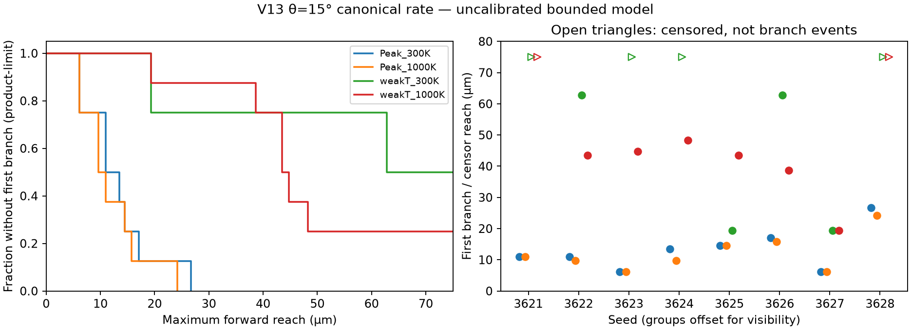
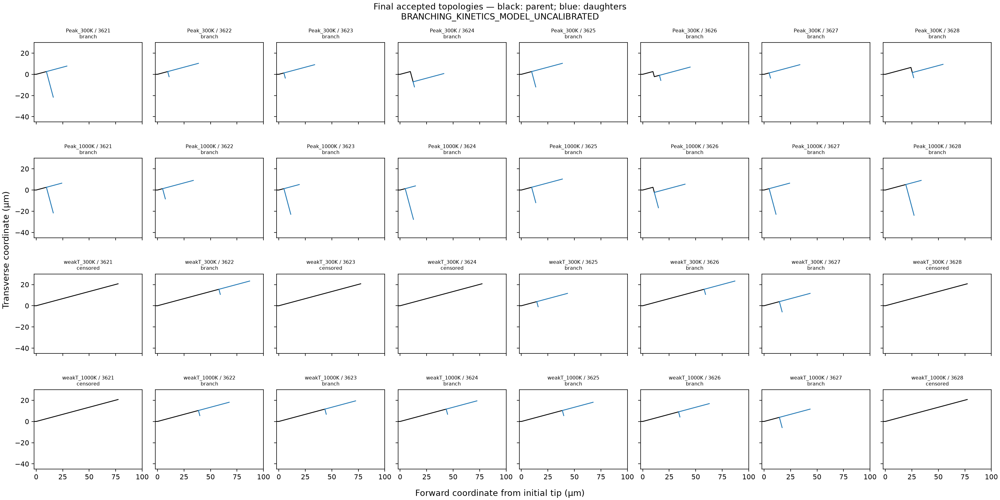

# V13 transition-regime screen and eight-seed followup

**BRANCHING_KINETICS_MODEL_UNCALIBRATED**

Observed result: **MIXED_FIRST_BRANCH_INCIDENCE_DEMONSTRATED_IN_TESTED_MODEL**. 26/32 cases formed a first branch within the prespecified common observation interval. These are outcomes of the tested uncalibrated model, not experimentally calibrated material probabilities.

## Screening and scope

Eight fresh branch-disabled parents screened 15° and 30° at the canonical loading rate; twelve qualified θ=40° frozen controls were reused, with no θ=40° trajectory rerun. At 15°, Peak at both temperatures predicted branches near 10.95 µm while both Weak-T controls remained negative within 75 µm. Weak-T/1000 K first predicted a branch at the overshooting 77.27 µm endpoint, explicitly outside the common interval. Weak-T/300 K remained negative even there. All four 30° parents predicted branches.

The 15° screen had chi on both sides of one and 26 nonsaturated opportunities. Exact pairs were admissible but far from energy veto (margin/release approximately 0.984–1.000): this selects a kinetic transition, not an energy-boundary transition. Loading-rate variation and new branch-model parameters were unnecessary and were not used.

## Observed incidence by group

| Group | Branches / 8 | Completed 75 µm negatives | Early-gate censored | Observed first-branch event range |
|---|---:|---:|---:|---|
| Peak_300K | 8 | 0 | 0 | [2, 7] |
| Peak_1000K | 8 | 0 | 0 | [2, 5] |
| weakT_300K | 4 | 4 | 0 | [4, 13] |
| weakT_1000K | 6 | 2 | 0 | [4, 10] |

## Interpretation

The eight common-random-number seeds are paired across groups at fixed orientation. Identical numeric seeds do not establish identical clock streams across orientations because candidate identifiers change; no cross-orientation paired-stream claim is made. The finite-sample incidence contrasts and censored first-branch curves describe these simulations only. Early gates are separately identified and are not counted as completed 75 µm negatives. Their censoring may be informative. No significance test, calibrated probability, or independent-trial binomial interval is assigned.

Seed 3621 was used to select the condition and serves as a screen/production replication control, not independent holdout evidence. Seeds 3622–3628 supply seven additional paired realizations. The eight-seed table is descriptive and does not remove condition-selection bias.

Excluding the selection seed, the additional 28 cases contain 24 observed branches, 4 completed 75 µm nonbranching observations, and 0 early-gate censors.

Branch position remains distinct from primary maximum reach at acceptance. The survival coordinate is the latter. The last discrete 5 µm event can overshoot the 75 µm reporting threshold; an unbranched run is censored at 75 µm without shortening or changing that event. No mark beyond the cutoff is committed. After an earlier first branch, the existing 20 µm daughter-growth stop or an existing legitimate gate applies.

The first-seed prospective screen/production controls match in physical process values, clocks, endpoint and geometry checks. Raw process hashes differ because complete screen diagnostics increment the mechanics-call observer serial. Both raw hashes and serials are retained; only engine_fields/_anisotropic_drive/mechanics_serial is excluded from the separate physical-value comparison. No tensor, kinetic state or RNG field is excluded. There is no new memory term, precursor lifetime, barrier, correlation time, material row, emission law, or marked-event bookkeeping change. Branch angles remain crystallographic; the morphology mark is still zero-global-time, and no recursive branch spacing or resolved two-embryo time history is validated.

The accepted θ=40° ensemble and its original nulls remain immutable. Its correct conclusion remains seed-dependent first-branch onset with saturated bounded incidence; the present condition is a separate domain, not a reinterpretation of that ensemble.

Excluding the absolute mechanics-call serial from a cross-run value comparison does not disable any within-run serial/freshness check. Those checks remain unchanged in production.

## Provenance and verification

The case table separates execution-source commits from the report-producer commit in summary.json. Raw terminal, checkpoint, mechanics, mark-ledger and final-field hashes are in provenance.json. The compact archive contains selected reports, tables and an incremental source Git bundle requiring accepted base f09ec8468d4d95df73385742611f3de44455f865. Full native trajectories, accepted checkpoints and portable final fields remain in the adjacent transition_ensemble directory on the Data drive. Screening source, qualified-family manifests and the immutable historical-ensemble seal are preserved in this branch.

Twenty preflight/default-off production fixture checks and ten reporting/launch-gate checks passed. The four seed-3621 prospective screen/production controls passed physical-value parity; observer-counter differences are explicitly retained. These checks qualify this bounded comparison, not the branch model against experiment.

